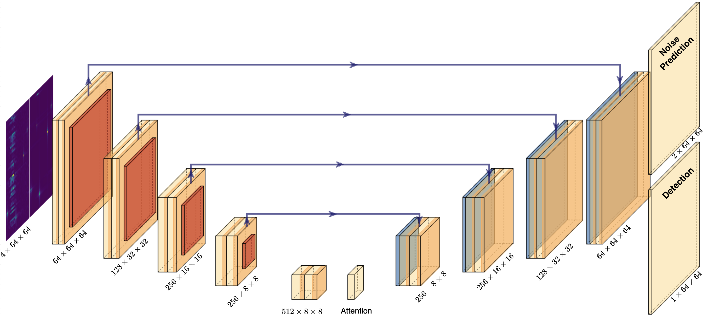
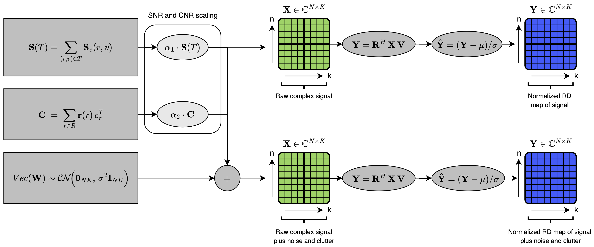

# RDDiffusion

[](https://opensource.org/licenses/MIT)
[](https://www.python.org/downloads/)
[](https://pytorch.org/)

Diffusion model for radar target detection using dual-head UNet architecture with Student-T noise scheduling. This project implements a deep learning approach to detect radar targets in heavy clutter environments using diffusion models.

## Features

- **Student-T Diffusion Process**: Robust noise scheduling for radar signal processing
- **Conditional dual-head UNet Architecture**: Time-conditioned denoising network
- **Synthetic Radar Dataset Generation**: Configurable SNR, CNR, and target parameters
- **CFAR Detection**: Classical CA-CFAR baseline for comparison
- **Visualization Tools**: Built-in plotting and analysis utilities

## Installation

### Quick Install

```bash
git clone https://github.com/arigra/Range-Doppler-Diffusion.git
cd Range-Doppler-Diffusion
pip install -e .
```

### Manual Install

```bash
git clone https://github.com/arigra/Range-Doppler-Diffusion.git
cd Range-Doppler-Diffusion
pip install -r requirements.txt
```

### Requirements

- Python >= 3.8
- PyTorch >= 2.0.0
- NumPy >= 1.24.0
- Matplotlib >= 3.7.0
- tqdm >= 4.65.0

## Usage

### Basic Training and Inference

```bash
python main.py
```

This will:
1. Load configuration from `configs/base_config.json`
2. Generate synthetic radar dataset
3. Train the diffusion model
4. Save the best model checkpoint
5. Run inference and evaluation

### Custom Configuration

Edit `configs/base_config.json` or create your own config file:

```python
from main import load_config, train_model
import torch

device = torch.device("cuda" if torch.cuda.is_available() else "cpu")
config = load_config("configs/my_config.json")
model, val_dataset = train_model(config, device, run_name="my_model")
```

## Configuration Parameters

| Parameter | Description | Default |
|-----------|-------------|---------|
| `SNR` | Signal-to-Noise Ratio (dB) | `[10]` |
| `CNR` | Clutter-to-Noise Ratio (dB) | `[15]` |
| `NU` | Student-T degrees of freedom | `[1.0]` |
| `n_targets` | Max number of targets per sample | `8` |
| `rand_n_targets` | Randomize target count | `true` |
| `noise_steps` | Diffusion timesteps (T) | `2000` |
| `beta_start` | Starting beta value | `0.0001` |
| `beta_end` | Ending beta value | `0.01` |
| `scheduler_type` | Noise schedule (`cosine`/`linear`) | `cosine` |
| `batch_size` | Training batch size | `16` |
| `learning_rate` | Adam optimizer learning rate | `0.0001` |
| `num_epochs` | Training epochs | `400` |
| `dataset_size` | Number of training samples | `5000` |
| `time_emb_dim` | Time embedding dimension | `256` |
| `num_workers` | DataLoader workers | `4` |

## Project Structure

```
rddiff/
├── main.py                # Main training and inference pipeline
├── configs/
│   └── base_config.json   # Default configuration
├── src/
│   ├── models/
│   │   ├── unet.py        # DetUNet architecture
│   │   └── diffusion.py   # StudentTDiffusion model
│   ├── dataset.py         # RadarDataset and data preparation
│   ├── trainer.py         # Training and validation loops
│   ├── inference.py       # Inference utilities
│   ├── evaluation.py      # Evaluation metrics
│   ├── cfar.py            # CA-CFAR detector
│   ├── visfuncs.py        # Visualization functions
│   └── plotters.py        # Additional plotting utilities
├── requirements.txt       # Python dependencies
├── setup.py               # Package installation
├── pyproject.toml         # Modern Python packaging
└── README.md              # This file
```

## Model Architecture



### DetUNet
- **Input**: 4-channel tensor (range-Doppler map + conditions)
- **Output**: 2-channel denoised target map
- **Architecture**: Dual-head U-Net with skip connections and time embeddings. One head for denoising, the second for detection
- **Time Conditioning**: Sinusoidal positional embeddings

### StudentTDiffusion
- **Forward Process**: Adds Student-T distributed noise over T timesteps
- **Reverse Process**: Learned denoising using DetUNet
- **Scheduler**: Cosine or linear beta schedule
- **Loss**: MSE between predicted and actual noise

## Dataset



The synthetic radar dataset simulates:
- **Range-Doppler maps** (64x64 bins)
- **Multiple targets** with configurable positions and velocities
- **Heavy clutter** with Student-T distributed noise
- **Configurable SNR/CNR** for varying difficulty levels

## Results

Models are evaluated using:
- **MSE**: Mean Squared Error on target reconstruction
- **PSNR**: Peak Signal-to-Noise Ratio
- **Validation Loss**: Denoising performance metric

Best models are saved automatically during training.

## License

This project is licensed under the MIT License - see the [LICENSE](LICENSE) file for details.

## Citation

After publication, switch the citation
If you use this code in your research, please cite:

```bibtex
@software{rddiffusion2025,
  author = {Ari Granevich},
  title = {RDDiffusion: Diffusion Models for Radar Target Detection},
  year = {2025},
  url = {https://github.com/arigra/rddiff}
}
```

## Contributing

Contributions are welcome! Please feel free to submit a Pull Request.

## Acknowledgments

- Built with PyTorch
- Inspired by denoising diffusion probabilistic models (DDPM)
